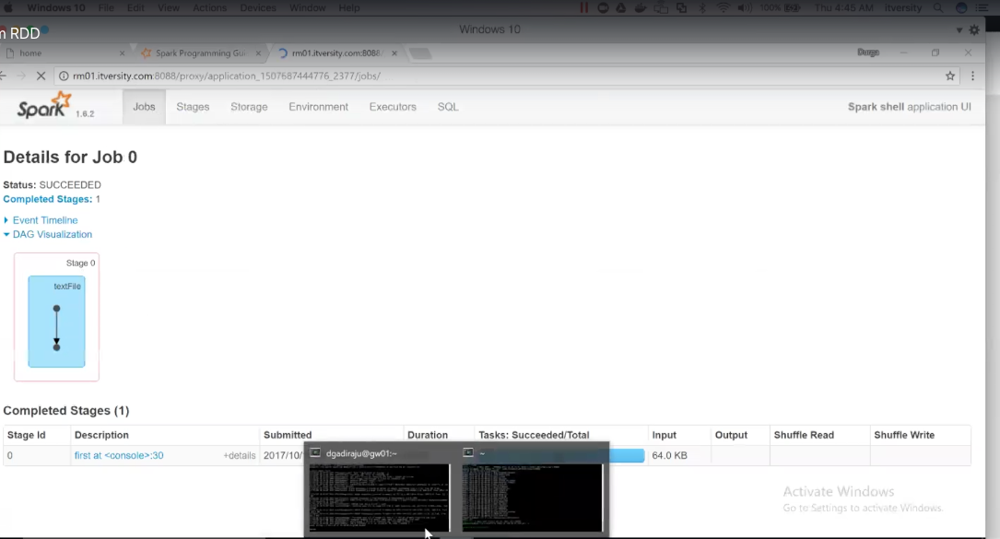
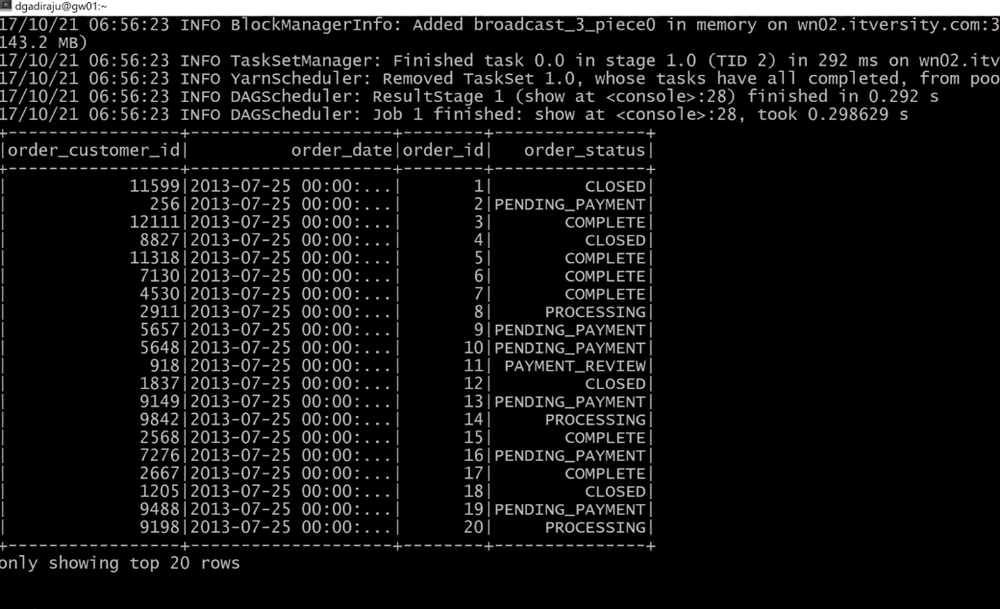

# cca175
certificcation cca175


# Start Spark local:
spark-shell

# Start spark remotely:

spark-shell --master yarn \
  --spark.ui.port=12654
  
# Spark with number of executors and memory
spark-shell --master yarn \
  --spark.ui.port=12654 \
  --num-executors 1 \
  --executor-memory 512M
  
  # spark-shell = spark + spark-dependency + implicit variables sc and sqlcontext
  
  sc  -> spark context is a web interface that is why we give port
  
  # Defalut configs:
  
  cd /etc/spark/conf/spark-defaults.conf
  spark-env.sh
  
  to stop spark context
  sc.stop()
  
  # Create a new one:
  val conf = new sparkconf().setapp("daily revenue").setmaster("yarn_client")
  val sc= new sparkcontext(conf)
  sc.getconf.getAll
  
# Create an RDD
```hadoop comamnd:```
hadoop fs -ls /public/retail_db/orders
```hadoop tail:```hadoop fs -tail <file name> (/public/retail_db/orders/part-0000)
  
 # Read a file and create an RDD
 val orders = sc.textFile("/public/retail_db/orders")
 
 # Read 1st element
  order.first
 # Read first 10 element
  order.take(10)
   above command creates an RDD from hadoop file .
 # If u want to create an RDD from file local file system
   ```steps:```
   1. read the file  and convert to list(e.g, val productRaw = scala.io.Source.fromFile("/data/retail_db/products/part-0000").getLines.toList)
   2. apply parallize (eg: val productsRdd =sc.parallize(productRaw)
   
  # 1 to 100 numbers to list
  val l = (1 to 100).toList
  # convert to rdd
  val l_rdd = sc.parallize(l)
  
  # Spark APIs are catagirised under based on lazy evaluation.
  1. transformations 
  2. actions (only performed under action is performed, lazyly executed) performed under DAG (directed acyclic graph)
 order.debug
 
 dag visuvalization can be seen in UI
 click on jobs-> click on job u wnat to see the DAG -> click on DAG visuvalization
  refer the image 
 

  val sc= new sparkcontext(conf)
  # take random sample
orders.takeSample(true,100)

# Actions:
collect() -> collect all values

count() -> get count

take() -> get first n no of rec

takeSample(withreplacement, num of recs) -> get random data

takeOrdered(n, ordering) -> get first n  no of recs in their order or a custom order

saveAsText(path) -> save as a HDFS file

saveAsSequenceFile(path) -> save as HDFS sequence file

saveAsObjectFile(path)  -> write in java serialization, which can be loaded using SparkContext.objectFile()

foreach() -> to execute across the rdd or rdd sample

# Read data from different file formats 
1. orc
2. json
3. paquet
4. avro

sqlcontext have these apis to read these file formats.
 ```command:``` sqlcontext.load. (PRESS tab u can see all the possibilities)
sqlcontext.read.  (PRESS tab u can see all the possibilities)
eg: to read json data 

val orderDF = sqlContext.read.json("/public/retail_db+json/orders")
```preview the data:```ordersDF.show() 
```print schema:```ordersDF.printSchema() 
```select the data:```ordersDF.select("order_id","order_date") 
or 
val orderDF = sqlContext.load("/public/retail_db+json/orders","json")


# RDD -> Distributed dataset
# DF -> dataframe is nothing but a structure on top of RDD


# Transfermations
Filtering (Horizontal and vertical)
String manipulation
row level transfermations
join
Aggregation
sort
Ranking
set operations

//String Manipulation
val str = orders.first
val orderId = a(0).toInt
check for string
a(1).contains("2013") ->returns true/false
orderDate.subString(0,10) -> substring( start index and end index) if u don't specify end index it wil print till end)
orderDate.replace('-','/') -> orderDate.replace(input String, output String)
orderDate.indexof("String", nth occourence) -> nth occourence of a string eg: orderDate,indexof(2)
orderDate.length
orderDate.concat

# row level transftermations

```Split:```
str.split(",")

# MAP and  Flatmap
map returns distrributed DS by just operate on single elemnet
flatmap returns distributed DS but each input item returns 0 or more elements.
df.take(10).foreach(println)
